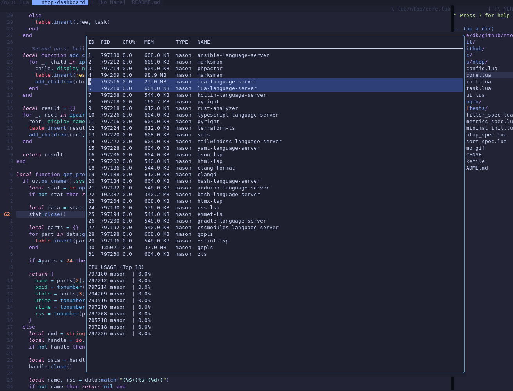
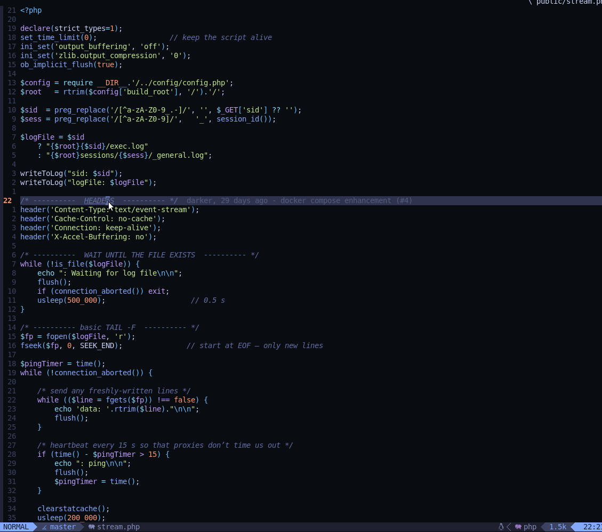

## ntop.nvim



ntop.nvim is a minimalist “top/htop”-style dashboard for Neovim that lists every running
LSP server and background job, lets you refresh in place, and kill the hogs
without leaving the editor.

## FEATURES
* **Live CPU % & RSS** for LSPs and jobs
* Full-width table + tiny ASCII CPU chart
* **r** – refresh • **k** – kill task under cursor • **q** – quit
* Works everywhere Neovim runs (mac / Linux / Windows)

## QUICK INSTALL

<details>
<summary>lazy.nvim</summary>

```lua
{ "sanix-darker/ntop.nvim", config = true }
````

</details>

<details>
<summary>packer.nvim</summary>

```lua
use { "sanix-darker/ntop.nvim", config = function() require("ntop").setup() end }
```

</details>

## USAGE

| Command         | Action                         |
| --------------- | ------------------------------ |
| `:Ntop`         | Open the dashboard             |
| `:NtopKill {p}` | Kill process **p** immediately |

Inside the window use **r** to refresh, **k** to kill the highlighted row,
and **q** to close.

## CONFIGURATION (OPTIONAL)

```lua
require("ntop").setup({
  border            = "single",   -- "rounded", "none", …
  refresh_rate_ms   = 1000,       -- 0 = disable auto-refresh
  default_signal    = "sigterm",  -- or "sigkill"
})
```

## DEMO



## DEVELOPMENT

```bash
# run tests
make test

# format with stylua
make format

# and to test it out
make dev-install
```

## AUTHOR

- [sanix-darker](https://github.com/sanix-darker)
